# Results via screenshots

## Table of contents

### **1. [Introduction](../project-report.md#introduction)**

### **2. [Project objective](../project-report.md#project-objective)**

### **3. [Project scopes](../project-report.md#project-scopes)**

### **4. [Problem definition](./problem-definition.md)**

### **5. [Key challenges](./problem-definition.md#key-challenges-addressed)**

### **6. [Summary of problem definition](./problem-definition.md#summary)**

### **7. [System design](./system-design.md)**

### **8. [Results via screenshots](./result-screenshots.md)**

### **9. [Conclusion](./conclusion.md)**

---

## File loading
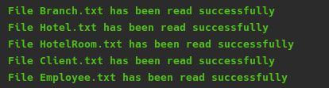

## Main menu
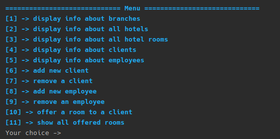

## Option 1: *Display info about branches*
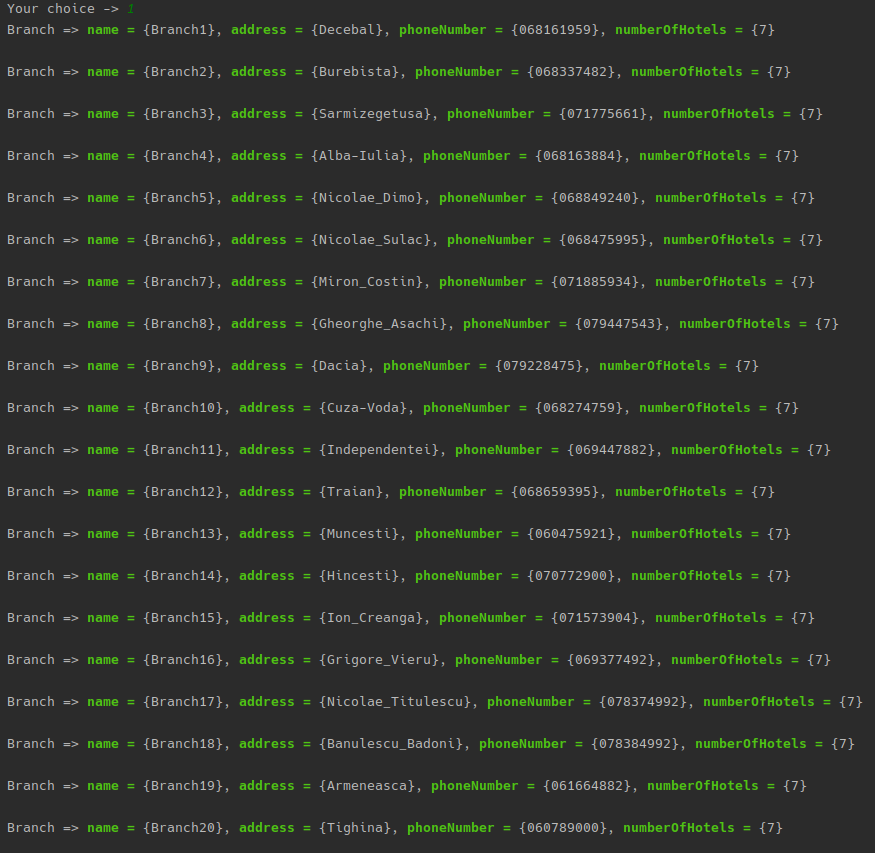

## Option 2: *Display info about all hotels*
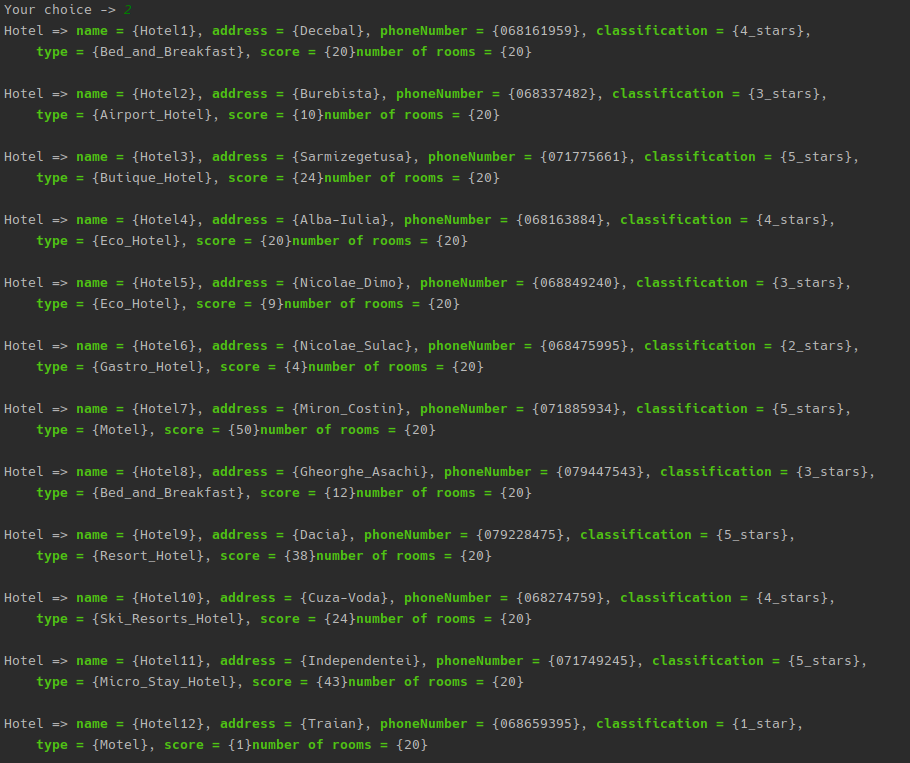
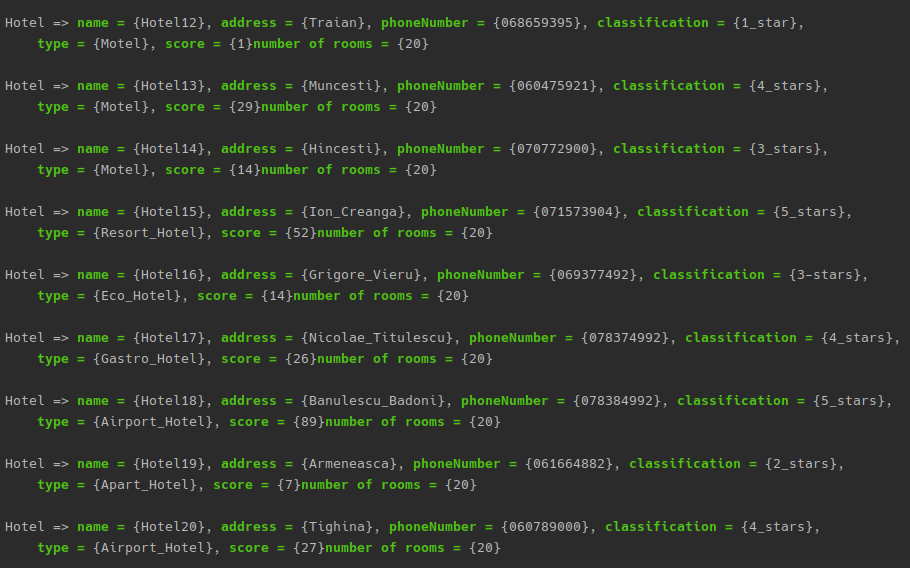

## Option 3: *Display info about all hotel rooms*
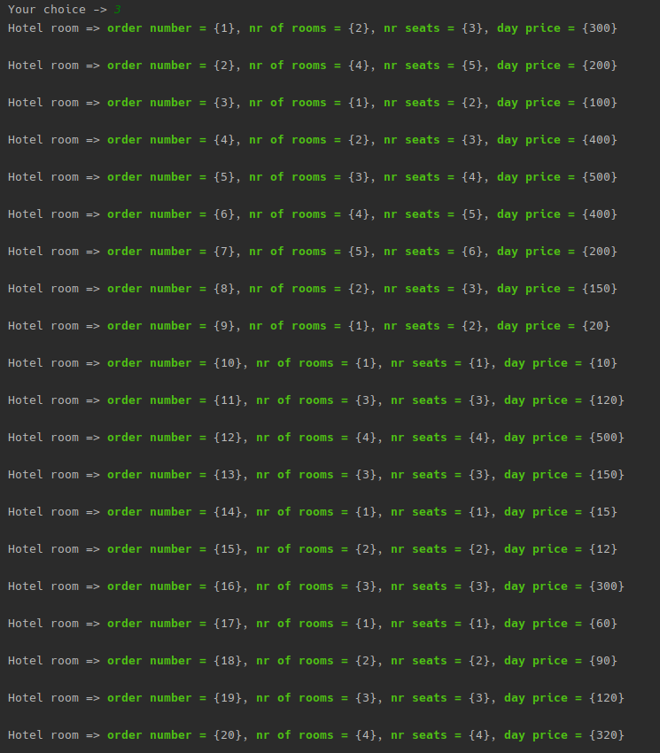

## Option 4: *Display info about clients*
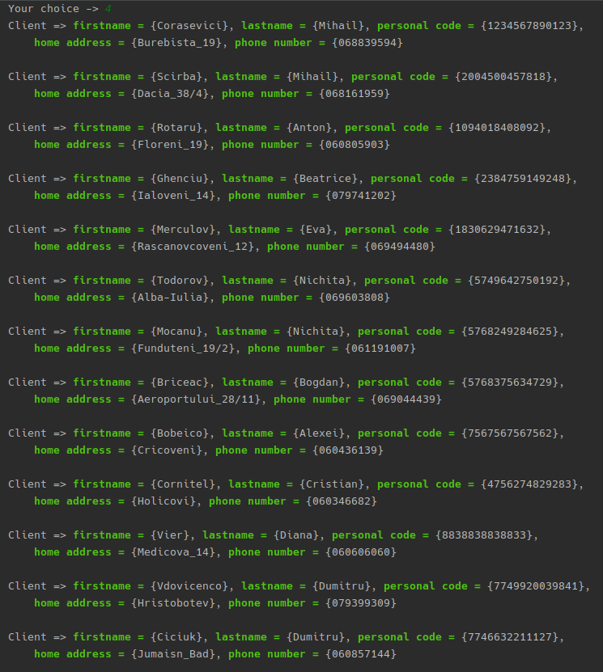
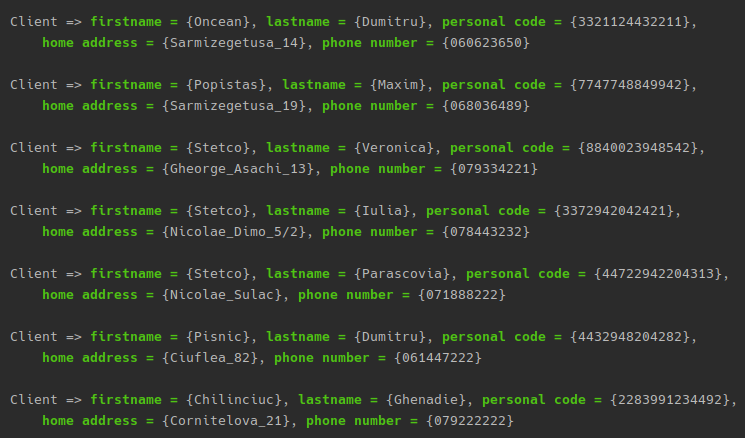

## Option 5: *Display info about employees*
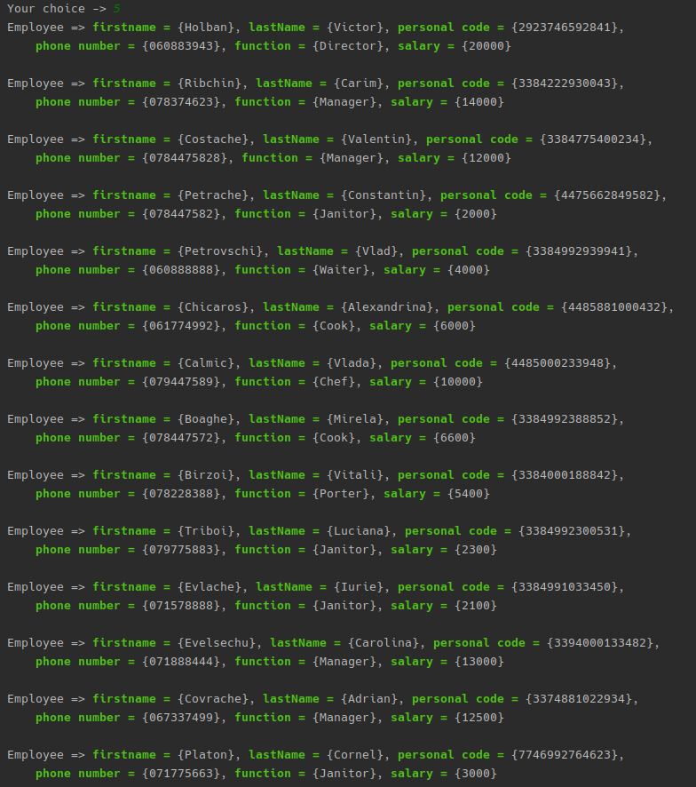
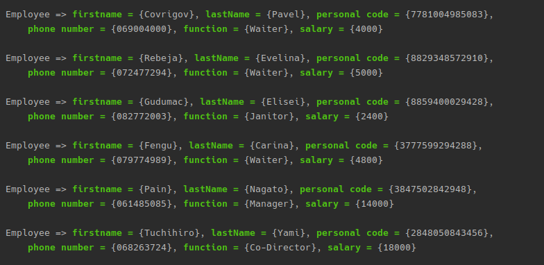

## Option 6: *Add a new client*
### Execution
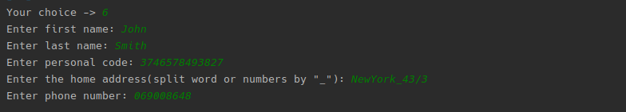
### Result
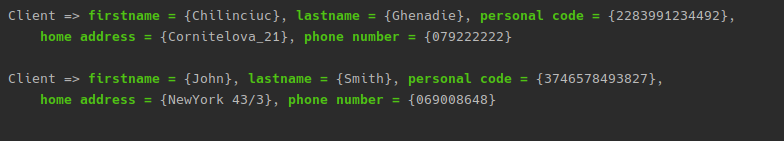

## Option 7: *Remove a client*
### Before execution
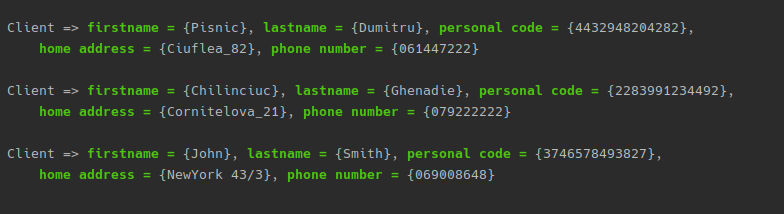
### Execution
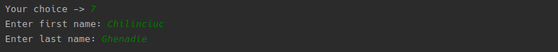
### Result
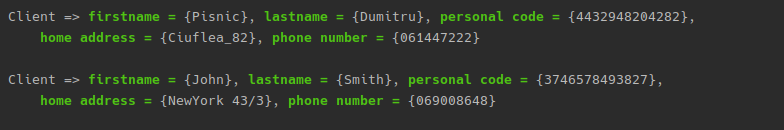

## Option 8: *Add a new employee*
### Execution
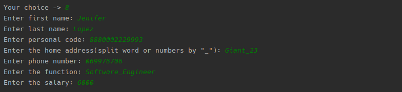
### Result
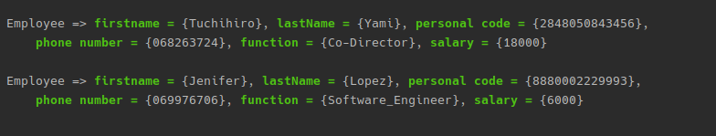

## Option 9: *Remove an employee"*
### Before execution
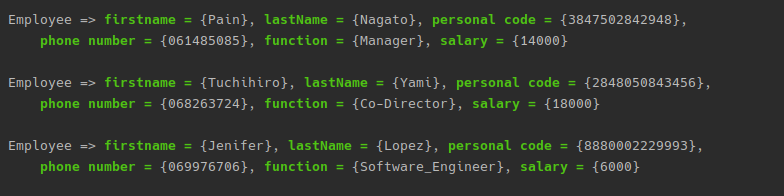
### Execution
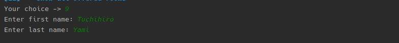
### Result
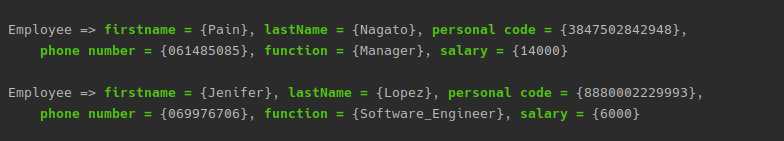

## Option 10: *Offer a room*
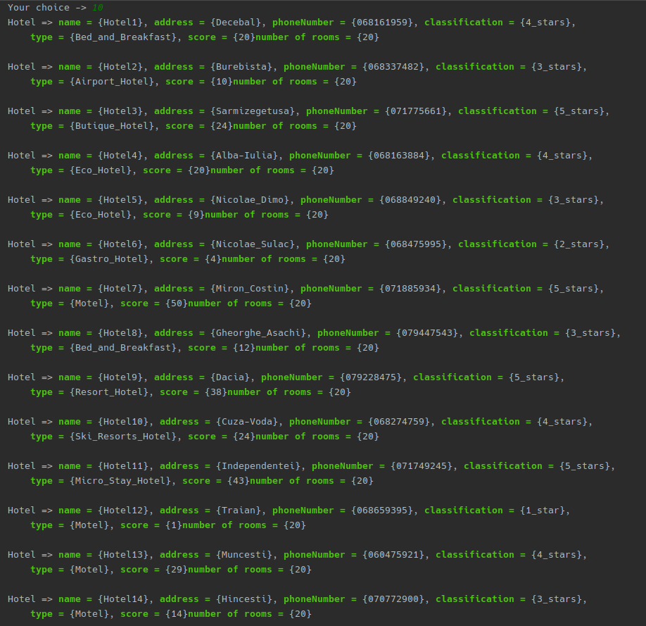
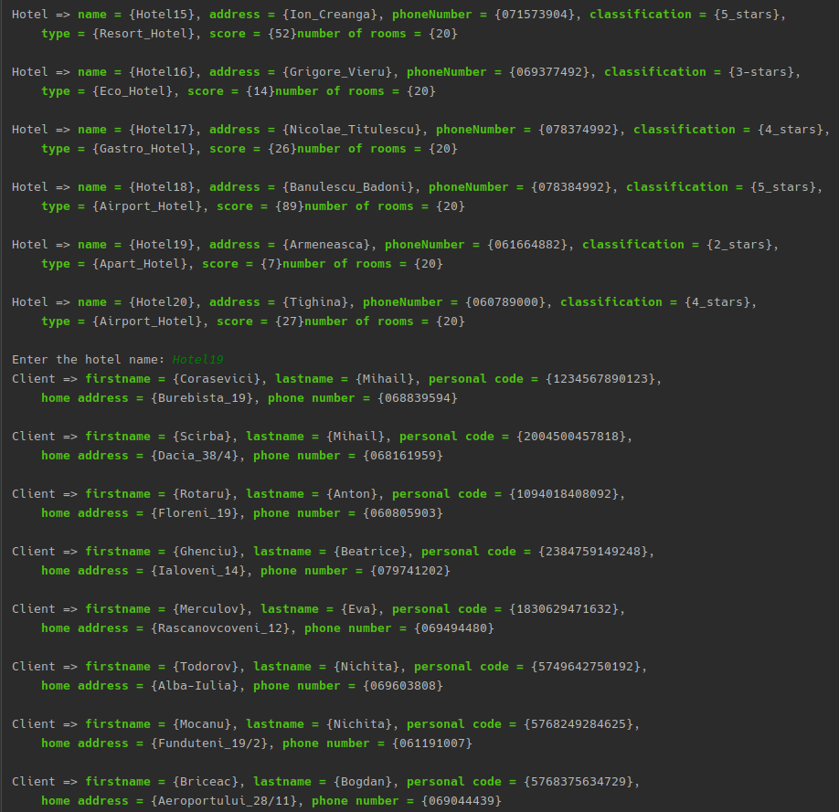
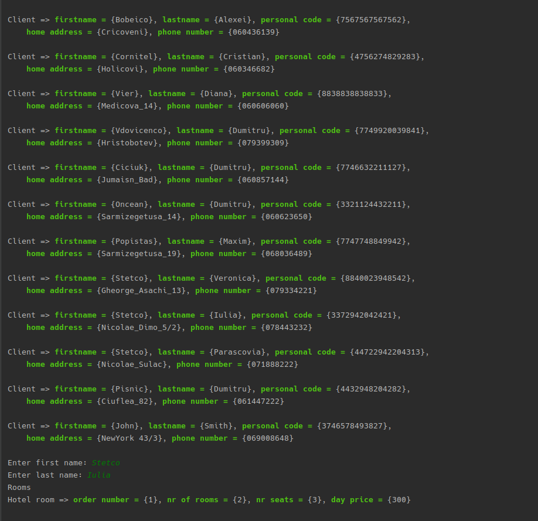
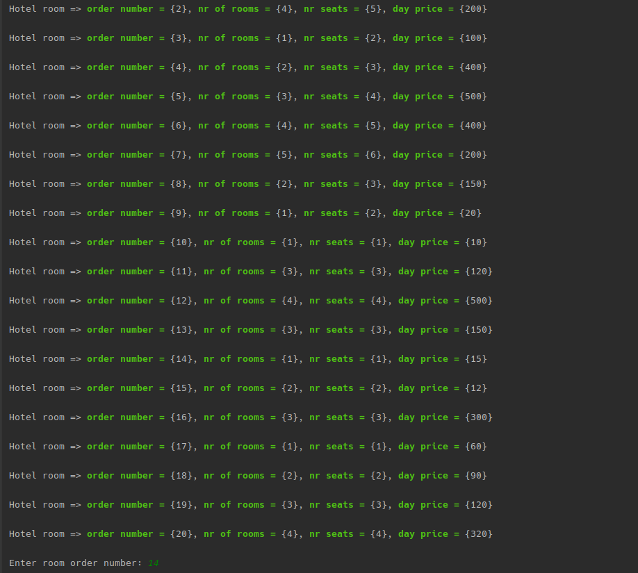
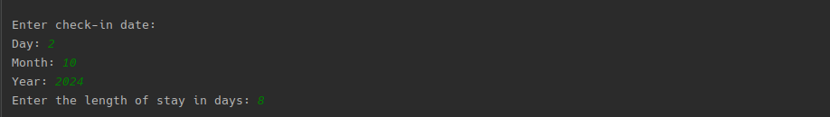

## Option 11: *Show offered rooms*
